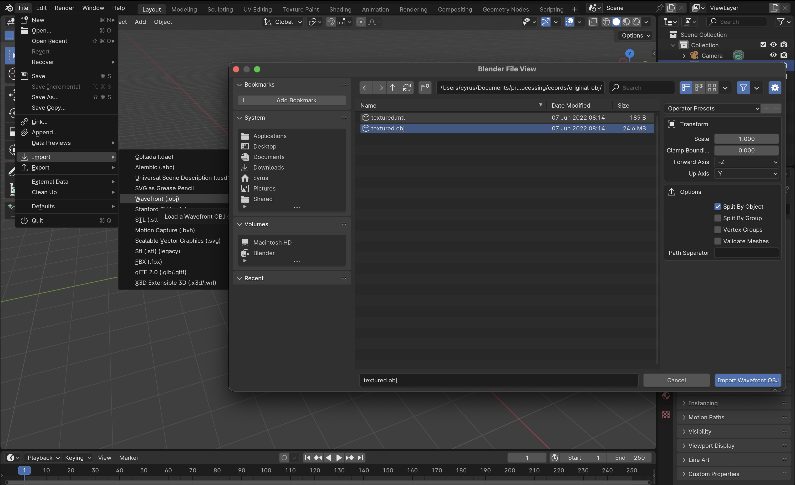
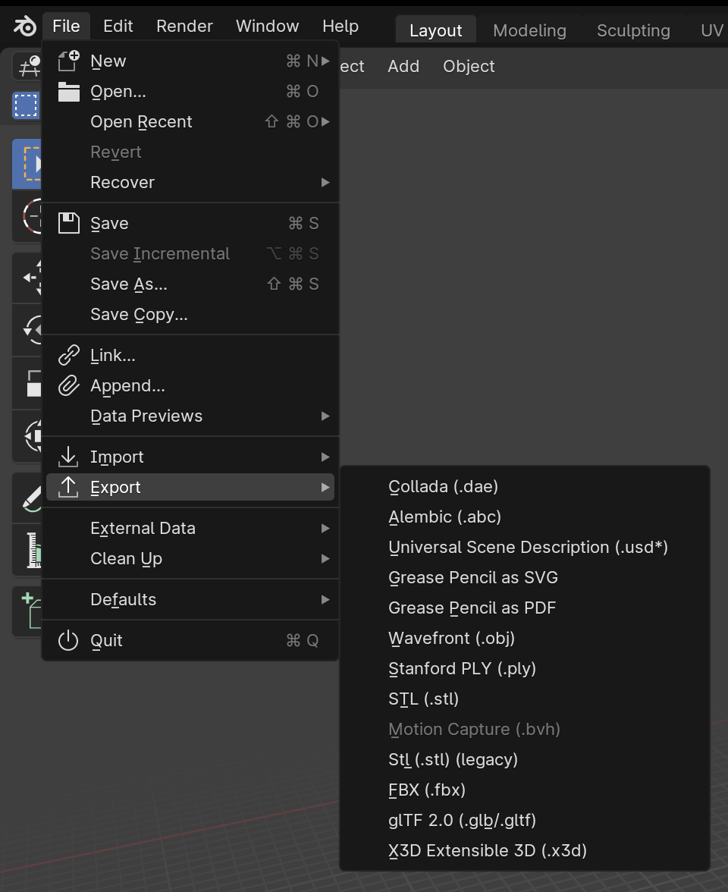
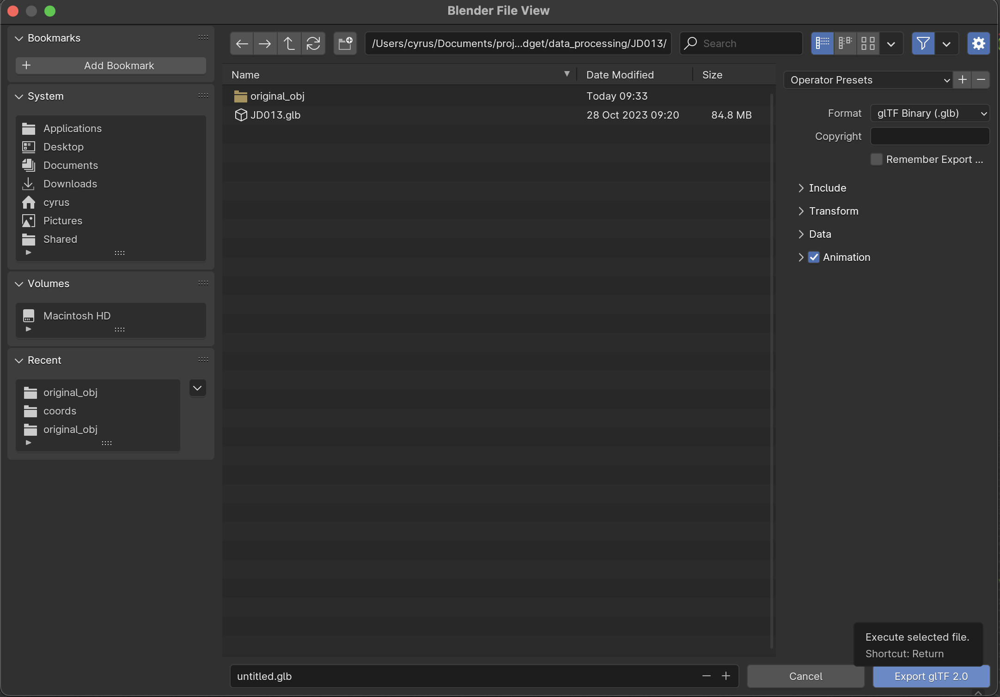
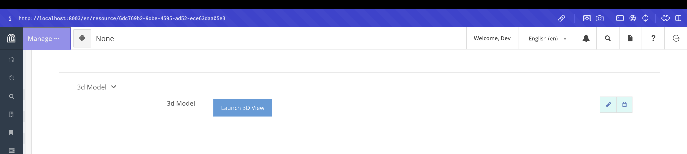

# Welcome to MAPSS!

For more information about the MAPSS project, please visit: https://mapss.shh.mpg.de/info/about/

Preparing 3D Model Data
=======================

The Arches 3d file viewer renders files in glTF binary (.glb) format. 
You can use Blender to convert .obj 3d models to .glb. 

The following screenshots were created using Blender Version 4.1.1 (2024-04-16). 

1. Open Blender. It will immediately create a new project with cube model by default. In the 'Scene Selection' right click on the cube entry and delete it.

*Remove cube*

2. In the main menu select: `File > Import > Wavefront(.obj)` and select the `.obj` file you want to process. If you have an .mtl (material) fil and any related image files, be aware that you only need to select the .obj file. Blender will automatically import the other files.

*Import obj*

3. When the file loads you will notice that the texture is not applied to the file. That's okay; it will be included in the export. If you want to see the texture applied in Blender, you can select 'Texture Paint' or 'Shading' from the main menu, but take care not to make any undesirable changes to your file that would affect the export.

4. To export the file go to `File > Export > GLTF 2.0 (.glb/.glTF)`

*Export menu*

*Export dialog*

That's it. Your 3D model should now display when you upload your .glb file and click `Launch 3D View` in a report.

*Launch 3D Viewer*
